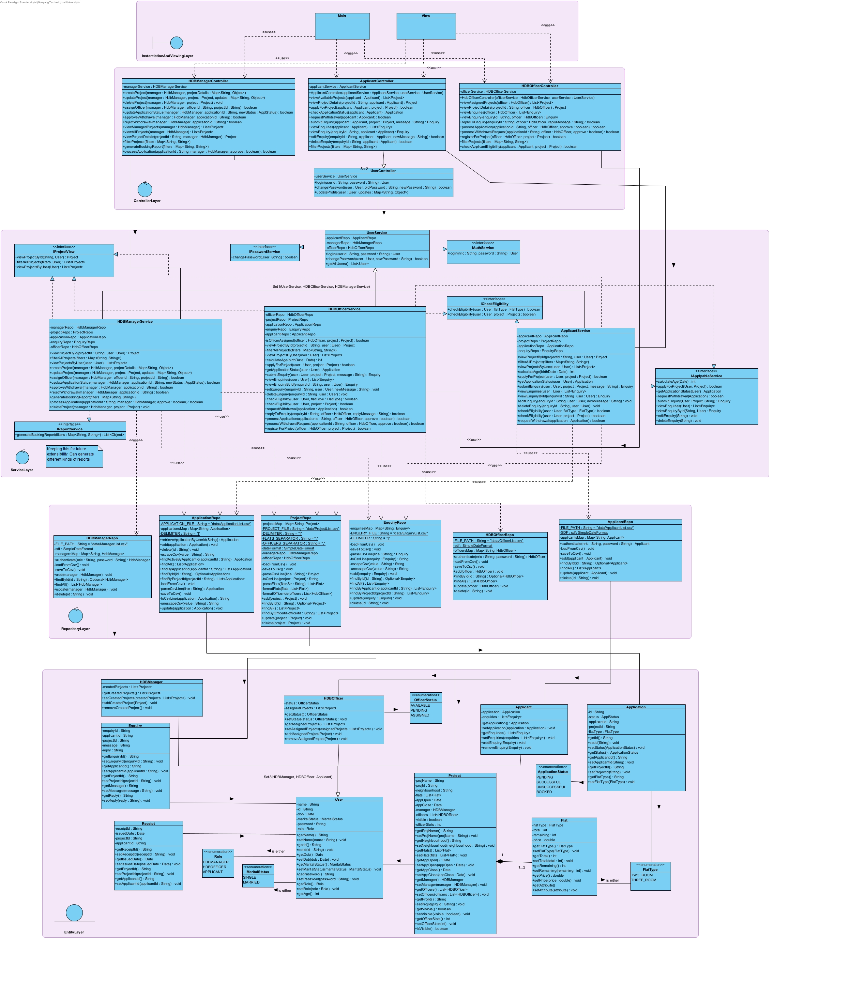
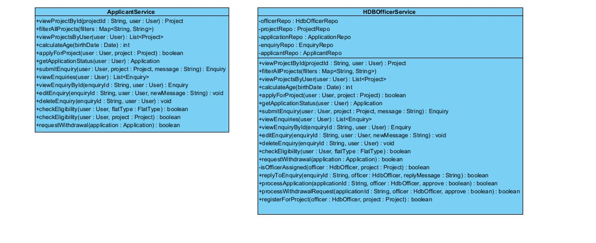
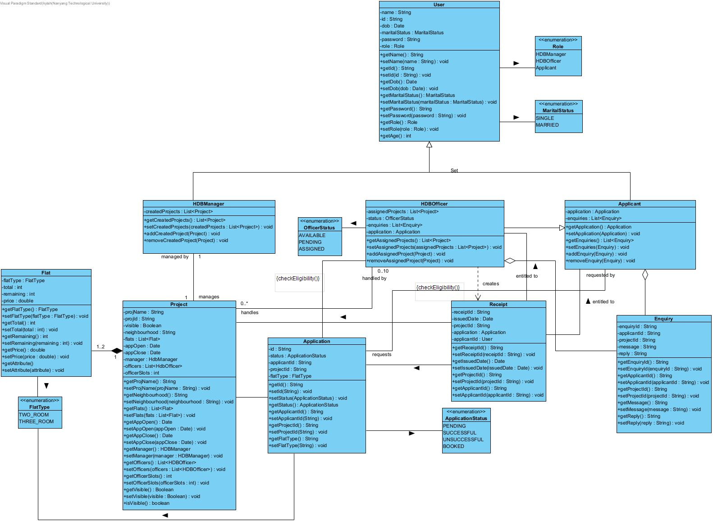

# Build-To-Order (BTO) Management System

## Project Overview

This project is a Command Line Interface (CLI) application developed as part of the SC2000 Object-Oriented Design & Programming course at Nanyang Technological University. The **BTO Management System** serves as a centralized platform for HDB Applicants, HDB Officers, and HDB Managers to interact with Build-To-Order (BTO) housing projects.

Users log in using their NRIC (User ID) and a password. The system manages user profiles, project listings, applications, enquiries, and reporting based on user roles.



## Features

The system implements functionalities based on three distinct user roles:

**1. Applicant:**
* View available BTO projects (filtered based on eligibility and visibility).
* Apply for a single BTO project (eligibility checks based on age and marital status).
* View their application status (Pending, Successful, Unsuccessful, Booked).
* Withdraw their application (subject to Manager approval).
* Submit, view, edit, and delete enquiries related to projects.
* View flat booking receipts after successful booking via an HDB Officer.
* Update their profile information (excluding NRIC).
* Change their password.

**2. HDB Officer:**
* Inherits all Applicant capabilities.
  * With added _constraints_:
    * Cannot apply for a project they are registered to manage.
    * Cannot manage more than one project during overlapping application periods.
* Register interest to manage a specific BTO project (subject to Manager approval and eligibility constraints).
* View the status of their project registration request.
* View details of the project they are managing (regardless of visibility).
* View and reply to enquiries for the project they manage.
* Process flat selections for successful applicants:
    * Retrieve applicant applications.
    * Update application status from "Successful" to "Booked".
    * Update remaining flat counts for the project.
    * Generate flat booking receipts for applicants.

**3. HDB Manager:**
* Create, edit, and delete BTO project listings (including name, location, flat types/units, dates).
* Toggle the visibility of projects for Applicants.
* View all projects (regardless of creator or visibility).
* Filter projects to view only those they created.
* View and manage HDB Officer registrations for their projects (approve/reject).
* Approve or reject Applicant BTO applications (considering flat supply).
* Approve or reject Applicant BTO application withdrawal requests.
* View enquiries for *all* projects.
* Reply to enquiries for projects they manage.
* Generate filtered reports (e.g., list of applicants with bookings, filtered by marital status, flat type, etc.).
* *Constraints:* 
  * Cannot apply for any BTO project.
  * Cannot manage more than one project during overlapping application periods.

**General Features:**
* User authentication (Login).
* Password management.
* Data persistence via CSV files.
* Role-based access control.

## Technologies Used

* **Language:** Java
* **Interface:** Command Line Interface (CLI)
* **Data Storage:** CSV files (No database, JSON, or XML).

## Project Directory Structure

Beyond the main source code located in `src/`, this project utilizes the following directories:

* **`data/`**: Contains CSV files and any other raw data used by the application.
* **`diagrams/`**: Holds image files for UML diagrams, such as class diagrams and sequence diagrams, illustrating the project's design.
* **`documents/`**: Stores project planning documents, initial design diagrams, and generated documentation like Javadoc.

## Project Structure

The project follows a layered architecture pattern:

* `app/`: Contains the main application entry point (`Main.java`).
* `controller/`: Handles user interactions and orchestrates application flow based on roles (`ApplicantController`, `HdbManagerController`, `HdbOfficerController`, `UserController`).
* `entity/`: Defines the core data models (POJOs) like `User`, `Applicant`, `Project`, `Application`, `Flat`, `Enquiry`, etc.
* `pub_enums/`: Contains enumerations for fixed sets of values like `Role`, `ApplStatus`, `FlatType`, `MaritalStatus`, `OfficerStatus`.
* `repository/`: Manages data access and persistence, reading from and writing to CSV files (`ApplicantRepo`, `ProjectRepo`, etc.).
* `service/`: Implements the core business logic and rules (`ApplicantService`, `HdbManagerService`, `HdbOfficerService`, `UserService`). Interfaces (`IAuthService`, `IReportService`, etc.) define service contracts.
* `util/`: Utility classes, potentially for data loading or helper functions (`PlaceholderDataUtil`).
* `view/`: Handles the presentation layer, specifically the CLI interactions (`CLIView`).
* `data/`: Contains the CSV data files used for persistence.

## Setup & Running

1.  **Prerequisites:** Java Development Kit (JDK) installed.
2.  **Compile:** Navigate to the `src` directory and compile the Java files:
    ```bash
    javac app/Main.java -d ../bin
    ```
3.  **Run:** Navigate to the `bin` directory (or the root directory if `bin` is in classpath) and run the main class:
    ```bash
    java app.Main
    ```
4.  **Data Files:** Ensure the `data` directory containing the necessary CSV files (`ApplicantList.csv`, `ProjectList.csv`, etc.) is accessible relative to where the application is run.
   * The application expects these files at  `"../data/ApplicantList.csv"`.

## Data Persistence

The application persists data using plain text CSV files located in the `data/` directory.

Each repository class (`ApplicantRepo`, `ProjectRepo`, etc.) is responsible for loading data from its corresponding CSV file upon initialization and saving data back to the file when modifications occur.

The delimiter used is `|`.

## Key Design Choices

The design emphasizes maintainability, testability, and adherence to object-oriented principles:

* **Layered Architecture & Separation of Concerns:** The division into `view`, `controller`, `service`, `repository`, and `entity` layers enforces the Single Responsibility Principle (SRP).
  * Each layer has a distinct responsibility:
      * `view` for presentation
      * `controller` for user input handling
      * `service` for business logic
      * `repository` for data access
      *  `entity` for data representation.
  * This separation conceptually aligns with Command-Query Responsibility Segregation (CSR) 
  
* **Encapsulation:** Data within `entity` classes (like `Applicant`, `Project`) is kept private and accessed/modified through public getter/setter methods, hiding internal implementation details.
* **Abstraction:** Interfaces (`IAuthService`, `IApplyableService`, `IReportService`, etc.) define contracts for services, hiding the specific implementation details from the client (Controllers). Repository classes abstract the details of CSV file manipulation.
* **Inheritance:** User types (`Applicant`, `HdbOfficer`, `HdbManager`) inherit common properties and methods from the base `User` class, promoting code reuse.
* **Polymorphism:** The use of interfaces allows different classes (e.g., future service implementations) to be treated uniformly through the interface type (Dependency Inversion).
* **SOLID Principles:**
    * **SRP:** Tthe layered architecture strongly supports SRP. Each class within a layer aims for a single responsibility (e.g., `ApplicantRepo` *only* handles data persistence for applicants).
    * **OCP (Open/Closed Principle):** The use of service interfaces (`IPasswordService`, `IReportService`) means the system is open for extension (new implementations can be added) but closed for modification (existing controllers depending on the interface don't need to change).
    * **LSP (Liskov Substitution Principle):** Subclasses like `Applicant` should be usable wherever the base class `User` is expected, maintaining behavioral consistency.
    * **ISP (Interface Segregation Principle):** Specific interfaces like `IApplyableService` ensure that client classes (like `ApplicantController`) only depend on methods relevant to their specific needs, rather than a large, monolithic user service interface.
    * **DIP (Dependency Inversion Principle):** High-level modules (Controllers) depend on abstractions (Service interfaces), not concrete low-level implementations. Services, in turn, depend on Repository abstractions . This promotes loose coupling.
* **Repository Pattern:** Data access logic is encapsulated within Repository classes (`ApplicantRepo`, `ProjectRepo`), isolating the rest of the application from the specifics of CSV data handling.
* **Enums:** Used for type safety and clarity for representing fixed sets of values like `Role`, `ApplStatus`, `FlatType`, ensuring consistency and preventing errors from using raw strings or integers.

## Authors/Contributors

* Darren Jong
* Kelvin Lek
* Kyla Hong
* Ong Yi Chen
* Tsen Fan Loong
